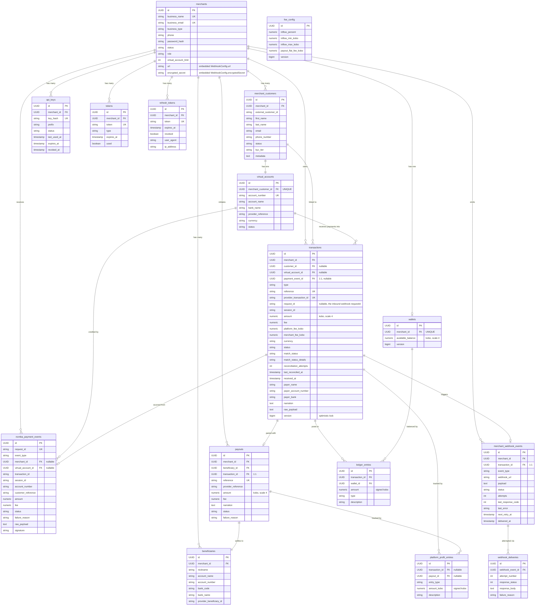
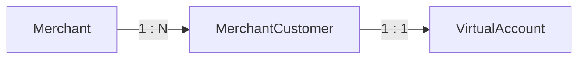
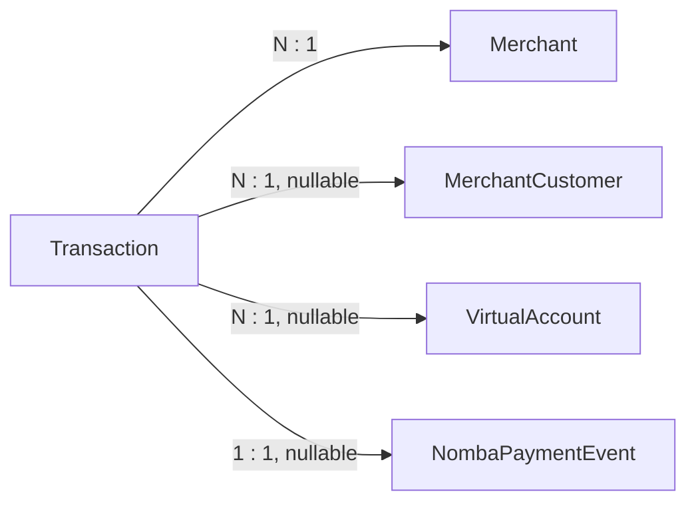
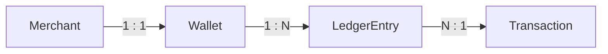
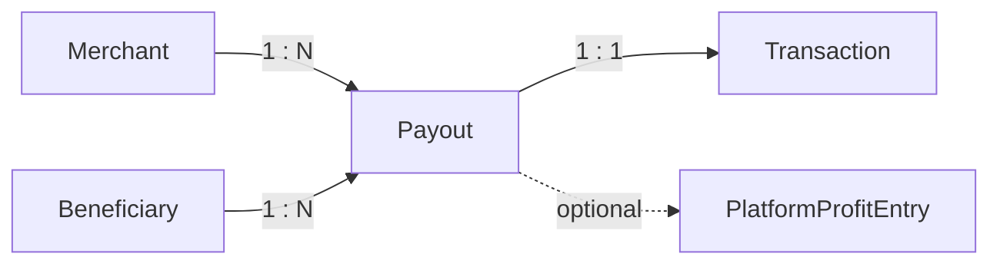
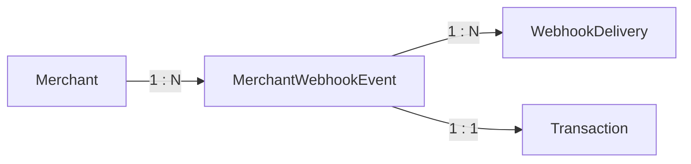
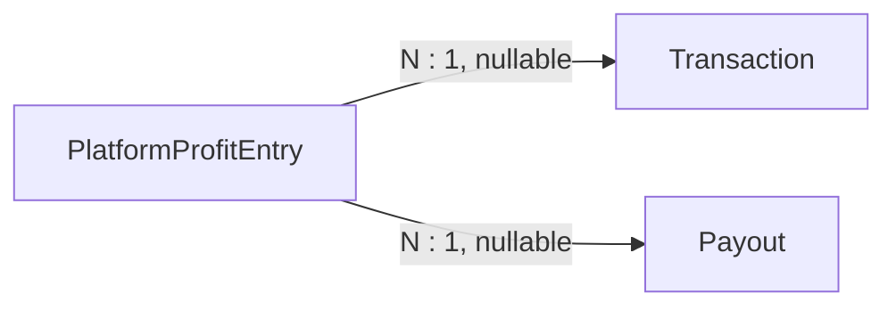
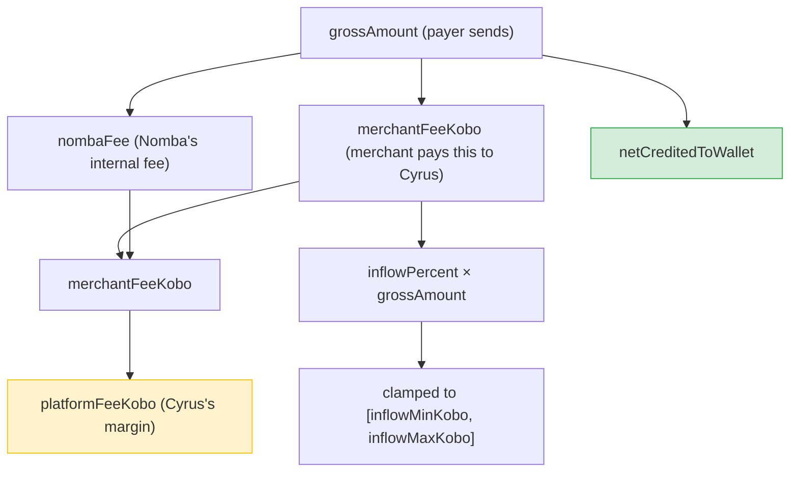
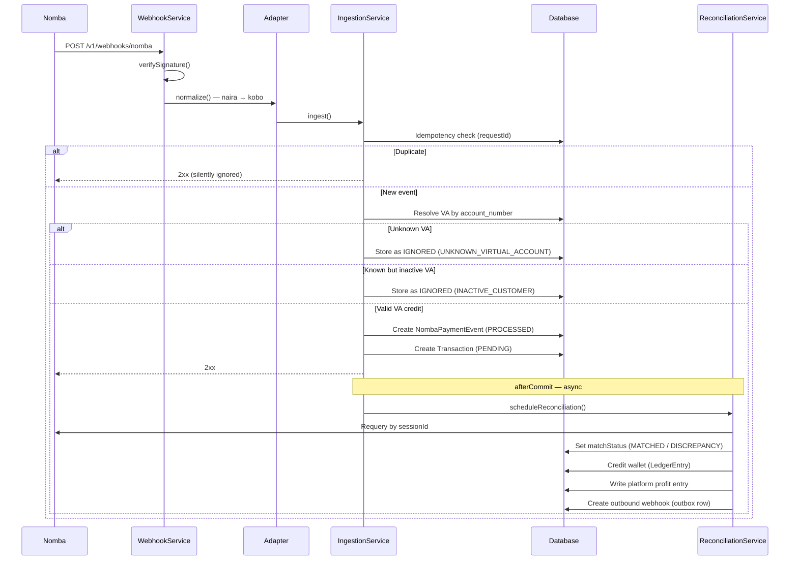
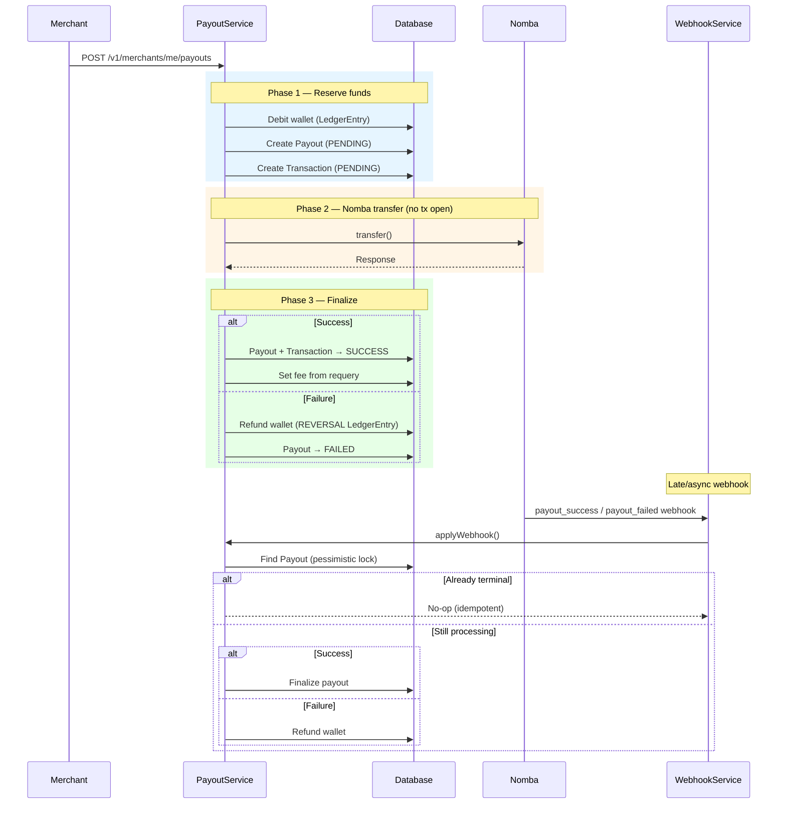

# Database Relationships

> Entity-relationship reference for the Cyrus PostgreSQL schema. All tables are managed by Flyway (`ddl-auto: validate`); any schema change is a new `V{n}__description.sql` migration, never an entity-only edit.

---

## Table of Contents

- [Entity-Relationship Diagram](#entity-relationship-diagram)
- [Relationship Details](#relationship-details)
- [Tables](#tables)
- [Money Model](#money-model)
- [Data Flow](#data-flow)

---

## Entity-Relationship Diagram

---

## Relationship Details

### Merchant → Customers → Virtual Accounts

- Each merchant has many customers.
- Each customer has exactly one dedicated virtual account (1:1, `MerchantCustomer` is the owning side).
- The `external_customer_id` on `MerchantCustomer` doubles as the Nomba `accountRef` — the value echoed on every incoming webhook as `aliasAccountReference`.
- Customer status (`ACTIVE` / `SUSPENDED` / `CLOSED`) cascades to the virtual account's Nomba-side status.

### Transaction Links

- `Transaction.customer` and `Transaction.virtualAccount` are nullable — orphan payments (unresolved VA numbers) are stored without a customer link until reattributed.
- `Transaction.paymentEvent` is nullable for internal-origin transactions (e.g. payouts created from `PayoutService`, not from inbound webhooks).

### Wallet & Ledger (Double-Entry)

- Each merchant has exactly one wallet.
- `Wallet.availableBalance` is a materialized running total of all `LedgerEntry.amount` values for that wallet.
- Ledger entries are append-only and signed: positive = credit, negative = debit.
- The wallet uses optimistic locking (`@Version`) to prevent concurrent balance corruption.

### Payout Flow

- A payout references the beneficiary (destination bank account) and the paired `Transaction` of type `PAYOUT`.
- The beneficiary's `account_number` + `bank_code` are the settlement key — verified against Nomba before payout initiation.

### Webhook Outbox (Outbound)

- `MerchantWebhookEvent` is an outbox row: written in the same transaction as the status change, then picked up by `MerchantWebhookDispatcher` via JobRunr.
- `WebhookDelivery` records each individual POST attempt (append-only audit trail).
- The unique constraint on `(transaction_id, event_type)` makes outbox creation idempotent.

### Platform Profit Ledger

- Every entry is anchored to either a `Transaction` or a `Payout` (or neither for manual adjustments).
- Written in the **same DB transaction** as the corresponding merchant wallet posting, ensuring both ledgers stay consistent.
- Running total is derived via `SUM(amount_kobo)` — there is no mutable balance column.

### Fee Configuration

- `fee_config` is a single-row table holding platform-wide fee parameters used by `FeeCalculator` and `FeeProperties`.
- Updated via super-admin API; loaded into memory at startup and refreshed on every update.
- Uses optimistic locking (`@Version`) to prevent concurrent overwrites.

---

## Tables

All tables inherit from `BaseEntity`, which provides:

| Column | Type | Notes |
|---|---|---|
| `id` | `UUID` | Primary key, auto-generated |
| `created_at` | `timestamptz` | Set once at insert via JPA auditing |
| `updated_at` | `timestamptz` | Updated on every modification |

### Core Domain Tables

| Table | Description | Key Constraints |
|---|---|---|
| `merchants` | Developer/business accounts | `business_email` UNIQUE |
| `merchant_customers` | Customers belonging to a merchant | UNIQUE `(merchant_id, external_customer_id)` |
| `virtual_accounts` | Nomba VAs, 1:1 with each customer | `account_number` UNIQUE, `merchant_customer_id` UNIQUE |
| `transactions` | Every money movement (payments, payouts, reversals) | `reference` UNIQUE, `provider_transaction_id` UNIQUE |
| `wallets` | Per-merchant balance | `merchant_id` UNIQUE |
| `ledger_entries` | Append-only double-entry audit trail | indexed on `transaction_id`, `wallet_id`, `type` |

### Provider Integration Tables

| Table | Description | Key Constraints |
|---|---|---|
| `nomba_payment_events` | Deduplicated inbound webhook records | `request_id` UNIQUE |
| `beneficiaries` | Bank accounts for merchant payouts | indexed on `merchant_id`, `(merchant_id, account_number)` |
| `payouts` | Outbound withdrawal records | `reference` UNIQUE, indexed on `status` |

### Platform Tables

| Table | Description | Key Constraints |
|---|---|---|
| `fee_config` | Single-row global fee configuration | N/A (one row, `@Version` for optimistic locking) |
| `platform_profit_entries` | Append-only platform profit ledger | indexed on `transaction_id`, `payout_id`, `entry_type`, `created_at` |

### Auth & Webhook Tables

| Table | Description | Key Constraints |
|---|---|---|
| `api_keys` | SHA-256 hashed API keys | `key_hash` UNIQUE, indexed for lookup |
| `tokens` | Single-use verification/reset tokens | `token` UNIQUE |
| `refresh_tokens` | Dashboard session refresh tokens | `token` UNIQUE |
| `merchant_webhook_events` | Outbox for outbound merchant webhooks | UNIQUE `(transaction_id, event_type)` |
| `webhook_deliveries` | Per-attempt delivery audit trail | indexed on `webhook_event_id` |

---

## Money Model

All monetary values use **`BigDecimal` kobo at scale 4** (`numeric(38,4)` in PostgreSQL).

| Rule | Detail |
|---|---|
| **Storage unit** | Kobo, never naira. ₦1 = 100 kobo. |
| **Precision** | Scale 4 — sub-kobo precision is preserved through fee math and ledger postings. |
| **Rounding** | Only at payout settlement (`PayoutService.koboToNaira`), where Nomba's transfer API requires whole kobo. |
| **Comparison** | Never use `BigDecimal.equals()` (scale-sensitive). Always use `compareTo()` or `signum()`. |
| **JSON output** | Plain decimal notation (`spring.jackson.write.write-bigdecimal-as-plain: true`). |
| **Provider boundary** | Nomba sends naira as a string (`"281946.0"`). Converted via `NombaCurrencyUtil.nairaToKobo()` (×100, normalize to scale 4). |

### Fee Breakdown on a Payment

---

## Data Flow

### Inbound Payment (Webhook)

### Outbound Payout

### Wallet Ledger Posting Rules

| Event | LedgerEntry Type | Direction | Amount |
|---|---|---|---|
| Confirmed inbound payment | `CREDIT` | Credit wallet | `gross - nombaFee - merchantFee` |
| Payout initiated | `DEBIT` | Debit wallet | `payout amount + payout fee` |
| Payout failure/refund | `REVERSAL` | Credit wallet | `payout amount + payout fee` (reversed) |
| Payment reversal | `REVERSAL` | Debit wallet | `net credited amount` (clawback) |
